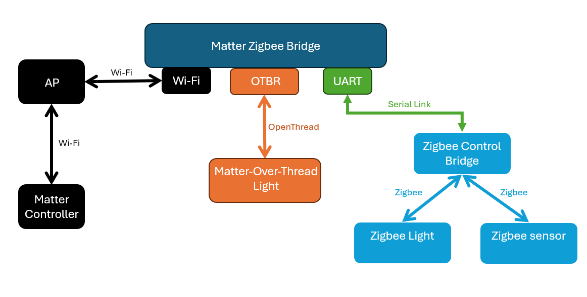
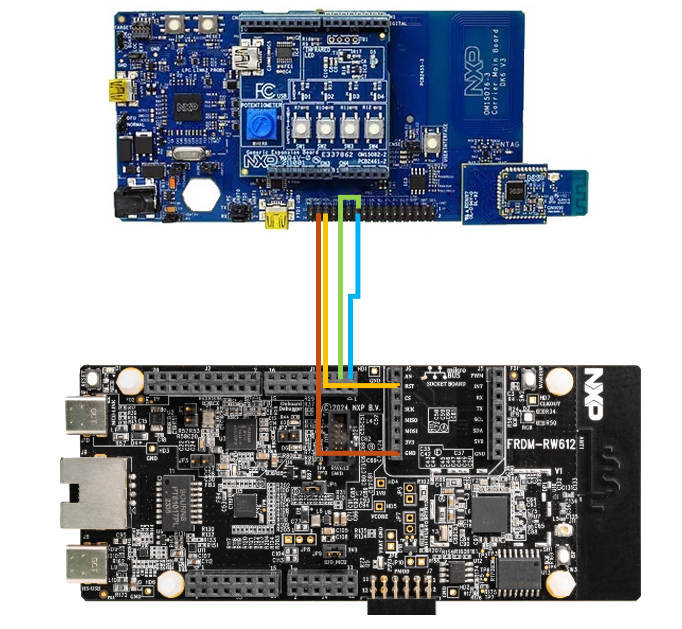

# NXP Application Code Hub

## matter zigbee bridge rw612
This user guide provide user how to integrate Non-Matter device as zigbee nodes to Matter enviroment。

Its infrastructure

Its Hardware Connection

#### Boards: RD-RW612-BGA
#### Categories: Wireless Connectivity, Bridge, RTOS
#### Peripherals: UART
#### Toolchains: GCC

## Table of Contents
1. [Software](#step1)
2. [Hardware](#step2)
3. [Setup](#step3)
4. [Results](#step4)
5. [Support](#step5)
6. [Release Notes](#step6)

## 1. Software
-	Ubuntu 20.04 as standalone PC or installed in the Virtual Machine like VirtualBox
-   Raspberry Pi with Matter latest released ChipTool 
-	MCUXpresso IDE v11.9.0
-	JLink version (> v.792f)
-	K32W061 SDK 2.6.11
-	DK6Programmer.exe (SDK_2_6_11_K32W061DK6\tools\JN-SW-4407-DK6-Flash-Programmer\JN-SW-4407 DK6 Production Flash Programmer v4564.exe)
-	Zigbee Control Bridge: JN-AN-1247\Binaries\ControlBridge_Full_GpProxy_115200\ControlBridge_Full_GpProxy_115200.bin (build with baud-rate set to 115200bps)
-	Zigbee Color Light: JN-AN-1244\Binaries\ExtendedColorLight_GpProxy_OM15081\ExtendedColorLight_GpProxy_OM15081.bin (Prebuild) 
-	Zigbee Temperature Sensor : JN-AN-1246\Binaries \LTOSensor_NtagIcode_Ota_OM15081R2\LTOSensor_NtagIcode_Ota_OM15081R2_V1.bin (Prebuild)
-	RW612 Matter-Zigbee-Bridge: /examples/bridge-app/nxp/rt/rw61x/out/debug/chip-rw61x-bridge-example.axf (append axf suffix to chip-rw61x-bridge-example)
-	MatterOverThread Light: /examples/lighting-app/nxp/k32w/k32w1/out/debug/chip-k32w1-light-example.axf (append axf suffix to chip-rw61x-bridge-example)

## 2. Hardware
-   Raspberry Pi 4b with Minimal 4G RAM + 64G SD
-	RW612 EVK A1 as MatterOverWifi+OTBR+Matter Zigbee Bridge (Host/Master)
-	RW612 J7 USB port as Matter CLI interface
- 	Remove R485,R486,R490 on RW612
-	K32W061 MEZZANINE module as Zigbee Coordinator 
	-	RW612 HD8 Pin1 (GPIO_56) Txd <=>  K32W061 J1 Pin7 Rxd
	-	RW612 HD8 Pin2 (GPIO_57) Rxd <=>  K32W061 J1 Pin5 Txd
	-	RW612 HD8 Pin7 (GPIO_55) Rst <=>  K32W061 J1 Pin16 Rst
	-	RW612 HD3 Pin6 Gnd           <=>  K32W061 J1 Pin19 Gnd
	-	RW612 J13  Pin7 3V3          <=>  K32W061 J1 Pin17 Vdd
-	USB-UART Converter as Matter information Logging
	-	RW612 HD2 Pin4 (GPIO_03) Txd <=>  Converter Rxd
	-	RW612 HD2 Pin14 Gnd          <=>  Converter Gnd
-	K32W148 as MatterOverThread Light
-	K32W061 as Zigbee ColorLight
-	K32W061 as Zigbee LightTemperatureOccupancy(LTO) Sensor

## 3. Setup
1. In Ubuntu:
   -  git clone -b v1.3.0.0-tag-nxp https://github.com/NXP/matter.git && cd matter && git submodule update --init --progress && change treat_warnings_as_errors inside /build/config/compiler/BUILD.gn from true to false （otherwise build error due to [-Werror=unused-but-set-variable])
   -  in new terminal && git clone https://github.com/nxp-appcodehub/dm-matter-zigbee-bridge-rw612.git && copy all files from /dm-matter-zigbee-bridge-rw612 to same location of above check-out repo
   -  in terminal that check out matter v1.3.0.0-tag-nxp code and under /matter : source ./scripts/activate.sh
   -  cd examples/bridge-app/nxp/rt/rw61x/ && gn gen --args="chip_enable_wifi=true chip_enable_openthread=true chip_enable_matter_cli=true is_sdk_2_15=true openthread_root=\"//third_party/connectedhomeip/third_party/openthread/ot-nxp/openthread-br\" enable_bridge=true rt_nvm_component=\"littlefs\"" out/debug
   -  ninja -C out/debug (chip-rw61x-bridge-example will be generated under /out/debug, appendix .axf to this file)
   -  flash chip-rw61x-bridge-example.axf to RW612 EVK by MCUXpresso IDE
2. Join RW612 to Matter network via Wifi   
   boot up RW612 and wait till message “CHIPoBLE advertising started” appears in its logs then run:
   
        chip-tool pairing ble-wifi 1 SSID Passwd 20202021 3840

   wait till message “Device commissioning completed with success” visible on Raspberry Pi which indicates this RW612 has been successfully joined Rpi as MatterOverWifi device.
3. Setup OpenThread Border Router (OTBR) on RW612 by following commands on its CLI
   -  otcli dataset init new
   -  otcli dataset panid 0xabcd     --- 0xabcd can be changed to other value
   -  otcli dataset channel 25       --- 25 can be changed between 11~26
   -  otcli dataset commit active
   -  otcli ifconfig up
   -  otcli thread start
   -  otcli state                    --- must wait till “leader” state appears
   -  otcli dataset active –x        --- thread dataset used in chip-tool similar to following : 0e08000000000001000035060004001fffe002088711152e77458a490708fdcbf744a91020cb05100c208752e1bd2586f0a87ed481890312030f4f70656e5468726561642d633130640410d60d95cb5db1044086f7813e66de19020c0402a0f7f80102abcd0003000019
4. Join K32W148 MatterOverThread Light App to RW612 OTBR
   Press SW2 on Factory-New K32W148 flashed with chip-k32w1-light-example.axf and “Started BLE Advertising” visible on its UART console then run:
   
      chip-tool pairing ble-thread 2 hex: 0e08000000000001000035060004001fffe002088711152e77458a490708fdcbf744a91020cb05100c208752e1bd2586f0a87ed481890312030f4f70656e5468726561642d633130640410d60d95cb5db1044086f7813e66de19020c0402a0f7f80102abcd0003000019  20202021 3840

   wait untill message “Device commissioning completed with success” appears on Rpi logs, which confirms that this K32W148 has been successfully joined Matter network through RW612 OTBR as MatterOverThread device.
5. Set up Matter ZB Bridge
   run following commands on RW612 CLI to form Zigbee network on external K32W061 MEZZANINE module that flashed with ControlBridge_Full_GpProxy_115200.bin then permit other Zigbee nodes to join it:
   -  zb-erasepdm         --- erase currently used Zigbee channel, skip this if want to continue on existing channel
   -  zb-nwk-form 11      --- can be any value between 11~26 as valid Zigbee channel
   -  zb-nwk-pjoin 255    --- 255 to enable and 0 to disable permit join
   
   Power on factory-new Color Light K32W061 flashed with ExtendedColorLight_GpProxy_OM15081.bin, following messages will dump on RW612 console:
   
        Add Color Light
        Node Type=3,Short=0x18d4,MAC=0x158d00031f1742,EP=12928
		
	(Here EP=12928 is the dynamic allocated endpoint that map the Non-Matter Zigbee node as Matter device, if more Zigbee nodes joined the RW612 Matter network, then increased
    dynamic endpoint as 12929,12930 … will be assigned to these additional nodes individually.)
	Power on factory-new Temperature Sensor K32W061 flashed with LTOSensor_NtagIcode_Ota_OM15081R2_V1.bin, silimar message visible on RW612 console.
   

## 4. Results
Run following commands through Rpi console and RGB on Color Light K32W061 will be changed accordingly:
   -  chip-tool onoff toggle 1 12928                                         --- RGB alternately On and Off
   -  chip-tool levelcontrol move-to-level 2 1 1 1 1 12928                   --- RGB bright level changed to 2
   -  chip-tool colorcontrol move-to-hue 32 1 1 1 1 1 12928                  --- RGB hue changed to 32
   -  chip-tool colorcontrol move-to-saturation 64 1 1 1 1 12928             --- RGB saturation changed to 64
   -  chip-tool colorcontrol move-to-color-temperature 128 1 1 1 1 12928     --- RGB temperature changed to 128
   -  chip-tool colorcontrol move-to-color 30000 60000 1 1 1 1 12928         --- RGB ColorX and ColorY changed to 30000 and 60000 respectively

## 5. Support
If you need help, please contact FAE or create a ticket to [NXP Community](https://community.nxp.com/).

#### Project Metadata

<!----- Boards ----->

<!----- Categories ----->

<!----- Peripherals ----->

<!----- Toolchains ----->

Questions regarding the content/correctness of this example can be entered as Issues within this GitHub repository.

>**Warning**: For more general technical questions regarding NXP Microcontrollers and the difference in expected functionality, enter your questions on the [NXP Community Forum](https://community.nxp.com/)

## 6. Release Notes
| Version | Description / Update                           | Date                        |
|:-------:|------------------------------------------------|----------------------------:|
| 1.0     | Initial release on Application Code Hub        | November 14th 2024 |
