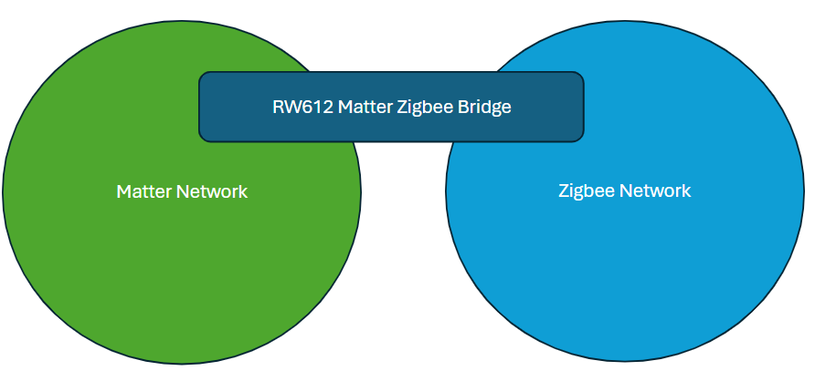

# NXP Application Code Hub

## Matter Zigbee Bridge FRDM-RW612 (Matter+Zigbee Standalone)
This user guide provides instructions on how to bridge non Matter devices such as Legacy Zigbee devices to the Matter ecosystem using NXP Wireless MCU system composed of NXP RW612 (Matter Over WiFi + Zigbee).

Design infrastructure:

### Boards: FRDM-RW612
### Categories: Wireless Connectivity, Bridge, RTOS
### Toolchains: GCC

## Table of Contents
1. [Software](#step1)
2. [Hardware](#step2)
3. [Setup](#step3)
4. [Running the demo](#step4)
5. [Results](#step5)
6. [Support](#step6)
7. [Release Notes](#step7)
   
## 1. Software requirements
-  Ubuntu 22.04 as standalone PC or installed in the Virtual Machine like VirtualBox
-  JLink version (> v.792f)

- [JN-AN-1244](https://www.nxp.com/webapp/Download?colCode=JN-AN-1244&appType=license) - Zigbee Color Light: JN-AN-1244\Binaries\ExtendedColorLight_GpProxy_OM15081\ExtendedColorLight_GpProxy_OM15081.bin (Prebuild)
-  [JN-AN-1246](https://www.nxp.com/webapp/Download?colCode=JN-AN-1246&appType=license) - Zigbee Temperature Sensor :
 JN-AN-1246\Binaries \LTOSensor_NtagIcode_Ota_OM15081R2\LTOSensor_NtagIcode_Ota_OM15081R2_V1.bin (Prebuild)
-  FRDM-RW612 Matter-Zigbee-Bridge: /dm-matter-zigbee-bridge-rw612/build/app.elf

## 2. Hardware requirements
-  Matter controller based on Matter 1.4 or newer
-  FRDM-RW612 board
-  USB-UART Converter as Matter information Logging
      -  FRDM-RW612 J5 Pin 4 (GPIO_03) FC0_UART_TXD <=>  Converter RX
      -  FRDM-RW612 J5 Pin 8 (GND)                  <=>  Converter GND
-  K32W061 as Zigbee ColorLight
-  K32W061 as Zigbee LightTemperatureOccupancy(LTO) Sensor

## 3. Setup
1. Creating the build environment & setting up Matter environment:
   - All the information required to set up the environment, build the application, and test, are available in the [Matter Documentation for NXP MCU platforms](https://docs.mcuxpresso.nxp.com/matter/latest/html/index.html)
   - In order to set up the environment, the local west.yml should be used to clone all the repos (west init -l [--mf FILE] directory OR  west init -m [https://github.com/nxp-appcodehub/dm-matter-zigbee-bridge-rw612.git](https://github.com/nxp-appcodehub/dm-matter-zigbee-bridge-rw612.git) sdk-next --mf west.yml --mr rw612_only)

2. Build the FRDM-RW612 Matter-Zigbee bridge app
   
   - Go back to the *dm-matter-zigbee-bridge-rw612* folder

         cd ../../../../dm-matter-zigbee-bridge-rw612

   - Build the example:

         west build -b frdmrw612 bridge-app/nxp/

  **Note:** If the SDK was placed in a specific folder, the path to Matter in CMakeList.txt (bridge-app/nxp/CMakeLists.txt:25 -> ${CHIP_ROOT}) must be modified 

   - Flash the application binary on the board by following [these instructions](https://github.com/NXP/ot-nxp/tree/release/v1.4.0/src/rw/rw612#flash-binaries)

3. Flash the K32W061 board with the Zigbee color light binary

   - Flash the binary on the borad using the [following instructions](https://github.com/NXP/ot-nxp/tree/release/v1.4.0/src/k32w0/k32w061#flash-binaries) 

## 4. Running the demo

1. Join FRDM-RW612 to Matter network via Wi-fi   
   boot up FRDM-RW612 and wait until message “CHIPoBLE advertising started” appears in its logs then run:
   
        chip-tool pairing ble-wifi 1 SSID Passwd 20202021 3840

   wait until message “Device commissioning completed with success” visible on Raspberry Pi which indicates this FRDM-RW612 has been successfully joined the Matter controller as MatterOverWifi device.

2. Set up Matter ZB Bridge
   run following commands on FRDM-RW612 CLI to form Zigbee network then permit other Zigbee nodes to join it:
   -  zb zb-erasepdm         --- erase currently used Zigbee channel, skip this if want to continue on existing channel
   -  zb zb-nwk-form 11      --- can be any value between 11~26 as valid Zigbee channel
   -  zb zb-nwk-steer        --- steering new devices (permit join)
   
   Power on factory-new Color Light K32W061 flashed with ExtendedColorLight_GpProxy_OM15081.bin, following messages will dump on FRDM-RW612 console:
   
        Add Color Light
        Node Type=3,Short=0x18d4,MAC=0x158d00031f1742,EP=12928
		
	(Here EP=12928 is the dynamic allocated endpoint that map the Non-Matter Zigbee node as Matter device, if more Zigbee nodes joined the FRDM-RW612 Matter network, then increased
    dynamic endpoint as 12929,12930 … will be assigned to these additional nodes individually.)
	Power on factory-new Temperature Sensor K32W061 flashed with LTOSensor_NtagIcode_Ota_OM15081R2_V1.bin, similar message visible on FRDM-RW612 console.
   

## 5. Results
Run following commands through Matter controller console and RGB on Color Light K32W061 will be changed accordingly:
   -  chip-tool onoff toggle 1 12928                                         --- RGB alternately On and Off
   -  chip-tool levelcontrol move-to-level 2 1 1 1 1 12928                   --- RGB bright level changed to 2
   -  chip-tool colorcontrol move-to-hue 32 1 1 1 1 1 12928                  --- RGB hue changed to 32
   -  chip-tool colorcontrol move-to-saturation 64 1 1 1 1 12928             --- RGB saturation changed to 64
   -  chip-tool colorcontrol move-to-color-temperature 128 1 1 1 1 12928     --- RGB temperature changed to 128
   -  chip-tool colorcontrol move-to-color 30000 60000 1 1 1 1 12928         --- RGB ColorX and ColorY changed to 30000 and 60000 respectively

## 6. Support
If you need help, please contact FAE or create a ticket to [NXP Community](https://community.nxp.com/).

#### Project Metadata

<!----- Boards ----->

<!----- Categories ----->

<!----- Peripherals ----->

<!----- Toolchains ----->

Questions regarding the content/correctness of this example can be entered as Issues within this GitHub repository.

>**Warning**: For more general technical questions regarding NXP Microcontrollers and the difference in expected functionality, enter your questions on the [NXP Community Forum](https://community.nxp.com/)

## 7. Release Notes
| Version | Description / Update                           | Date                        |
|:-------:|------------------------------------------------|----------------------------:|
| 1.0     | Initial release on Application Code Hub        | November 14th 2024 |
| 1.1     | Update to Matter 1.4                           | April 25th 2025  |
| 2.0     | Added new version of Zigbee Matter bridge. Zigbee is running directly on RW612. Cluster management is achieved by registering specific CommandHandlers.                                           | September 25th 2025 |
| 2.1     | Reference connectivity-addons                  | November 18th 2025  |